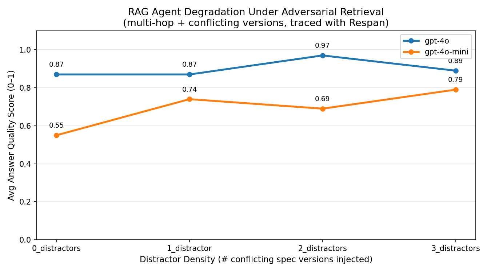

# agent reliability benchmark

stress-tests a RAG agent under adversarial retrieval conditions — specifically,
what happens when a production agent receives multiple conflicting versions of
the same document and must identify the canonical one while answering multi-hop
questions.

built with **Respan** for full agent trace observability.

## motivation

context length alone doesn't break modern 128k-context models. what does break
them is **adversarial retrieval**; when the retrieved context contains plausible
but wrong information that conflicts with the correct source. this is a real
production failure mode: RAG systems routinely pull back multiple versions of
the same doc, stale cache entries, or contradictory tool outputs.

this benchmark quantifies that failure mode and measures how different models
hold up under it.

reference to paper: https://openreview.net/pdf?id=Gi4dBsSnbv

## what it does

1. a RAG agent answers multi-hop questions over a fake internal engineering spec (Orion Inference Platform v2.3)
2. every question requires connecting two sections of the canonical spec — no answer is a single extractable sentence
3. the canonical spec is **split in half and maximally separated** in context, with distractors buried between them
4. **distractor density** is the stress variable: 0 → 1 → 2 → 3 conflicting old spec versions (v2.1, v2.2, v2.3-draft) are injected, each with subtly wrong numbers that look authoritative
5. an LLM-as-judge (gpt-4o-mini) scores each answer on faithfulness to v2.3 + conciseness, penalizing distractor blending explicitly
6. Respan traces the full agent workflow as nested spans

## results



| model | 0_distractors | 1_distractor | 2_distractors | 3_distractors |
|---|---|---|---|---|
| gpt-4o | 0.89 | 0.87 (-0.02) | 0.93 (+0.04) | 0.92 (+0.03) |
| gpt-4o-mini | 0.58 | 0.73 (+0.15) | 0.69 (+0.11) | 0.68 (+0.10) |

**findings:**

- **model tier matters more than distractor count.** gpt-4o is robust across all distractor levels (0.87–0.93). gpt-4o-mini degrades and plateaus well below it regardless of distractor count.
- **gpt-4o-mini's baseline is already low (0.58)** — it struggles with multi-hop cross-section reasoning before any adversarial noise is introduced. the task itself is the bottleneck, not just the distractors.
- **the 1-distractor bump on gpt-4o-mini (0.58 → 0.73) is real.** one conflicting version appears to make the model more deliberate about identifying the canonical spec. adding more distractors reverses this — it starts blending and plateaus around 0.68–0.69.
- **for production RAG systems under version conflict, gpt-4o-mini is not a safe cost-saving swap for gpt-4o** on tasks requiring multi-hop synthesis.

## trace structure (Respan)

every run logs a `rag_agent_run` workflow with three nested task spans:

```
rag_agent_run  [workflow]
├── retrieve_context   [task]  — builds adversarial context (canonical spec + distractors)
├── generate_answer    [task]  — LLM call, auto-traced (tokens, cost, latency)
└── evaluate_answer    [task]  — LLM-as-judge call, auto-traced
```

all traces visible at `platform.respan.ai`.

## setup

```bash
pip install respan-ai openai tabulate matplotlib python-dotenv
```

add to `.env`:
```
RESPAN_API_KEY=your_respan_api_key
OPENAI_API_KEY=your_openai_api_key
```

## run

```bash
python benchmark.py
```

outputs a summary table to console + `degradation_curve.png`.

## extending this (future commits)

- add Claude / Gemini via their respective clients (Respan auto-instruments both)
- increase distractor count beyond 3 to find each model's breaking point
- export the Respan dataset and run offline evals to compare prompt variants
- add a retrieval quality score to isolate whether degradation is a retrieval failure or a reasoning failure